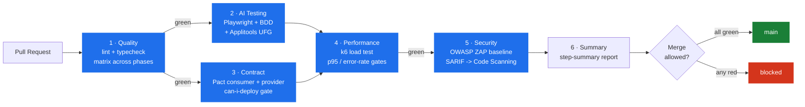

# QA Quality Architect Portfolio

[](.github/workflows/master-pipeline.yml)
[](.github/workflows/zap-baseline.yml)


A single repo demonstrating the full quality-engineering stack a Quality Architect owns end-to-end: AI-augmented UI testing, consumer-driven contract testing, k6 performance gates, and OWASP security scanning, all stitched together by one master CI pipeline. Built over a 45-day upskilling sprint to move from Senior QA to Quality Architect.

> **One pipeline. Four gates. Zero merges through if any one of them is red.**

---

## The four phases

| # | Phase | What it proves | Stack | Subfolder |
|---|-------|----------------|-------|-----------|
| 1 | AI-Assisted Testing | I use AI tools professionally — visual diffs, self-healing tests, Copilot-driven test generation, BDD on top of Page Objects | Playwright · playwright-bdd · Applitools Eyes · GitHub Copilot · Allure | [`phase-1-ai-testing/`](phase-1-ai-testing/) |
| 2 | API & Contract Testing | I prevent integration drift before deploy — consumer-driven contracts with `can-i-deploy` gates, REST + GraphQL coverage | Pact.io · Pact Broker · Postgres · Zod · Playwright | [`phase-2-contract-testing/`](phase-2-contract-testing/) |
| 3 | k6 Performance Testing | I own performance as a pipeline gate — load / stress / soak with SLA thresholds, Grafana dashboards, fail-on-regression | k6 · TypeScript · InfluxDB · Grafana | [`phase-3-performance/`](phase-3-performance/) |
| 4 | CI/CD + Docker + Security | I tie it all together — containerised runners, single master pipeline, OWASP ZAP baseline as the final gate | Docker · GitHub Actions · OWASP ZAP · SARIF | [`phase-4-pipeline/`](phase-4-pipeline/) |

Each subfolder has its own README with the deep-dive (architecture, pitfalls, design choices). This root README is the map.

---

## Architecture — the master quality gate



The pipeline lives in [`.github/workflows/master-pipeline.yml`](.github/workflows/master-pipeline.yml). It enforces a strict order: faster gates run first, slower gates only run if everything before them passed. ZAP is a reusable workflow ([`zap-baseline.yml`](.github/workflows/zap-baseline.yml)) so it can also be invoked manually or weekly via cron.

---

## Quickstart

```bash
# 1. Bring up backing services (Pact Broker + Postgres + InfluxDB + Grafana)
cp .env.example .env                  # adjust passwords if needed
docker compose up -d --wait

# 2. Phase 1 — AI testing suite
cd phase-1-ai-testing
cp .env.example .env                  # add APPLITOOLS_API_KEY (optional)
npm ci
npx playwright install --with-deps chromium
npm test                              # BDD suite, skips @flaky scenarios

# 3. Phase 2 — contract tests against the local broker
cd ../phase-2-contract-testing/consumer && npm ci && npm test
cd ../provider                         && npm ci && npm run pact:verify

# 4. Phase 3 — k6 performance gate
cd ../../phase-3-performance && npm ci
K6_ENV=sandbox k6 run tests/foundations/foundations-test.ts
K6_ENV=sandbox k6 run tests/load/load-test.ts

# 5. Phase 4 — security scan against the same target
docker run --rm -t ghcr.io/zaproxy/zaproxy:stable \
  zap-baseline.py -t https://jsonplaceholder.typicode.com
```

Or run the entire thing in containers:

```bash
docker build -t qa-phase1:local phase-1-ai-testing
docker build -t qa-phase3:local phase-3-performance
docker run --rm qa-phase1:local
docker run --rm qa-phase3:local run tests/foundations/foundations-test.ts
```

---

## What's in each phase (the 30-second tour)

**Phase 1 — `phase-1-ai-testing/`.** Eight Gherkin features (four SauceDemo, four OrangeHRM) driving nine Page Objects through playwright-bdd, plus a REST API suite against jsonplaceholder. Applitools Ultrafast Grid handles the visual diffs DOM assertions can't see — exactly what `problem_user` on SauceDemo is built to break. OrangeHRM login is cached via `globalSetup` + `storageState`, dropping per-scenario login from ~20s to ~4s. Two `@flaky` scenarios are gated behind a tag so default CI stays deterministic.

**Phase 2 — `phase-2-contract-testing/`.** Consumer-driven contract testing as the production-ready reference implementation: a consumer publishes a pact, the provider verifies against it, and `can-i-deploy` is the deployment gate. Runs against a real Pact Broker (Postgres-backed) so the integration is end-to-end, not a mock. Verification matrix screenshot is in `phase-2-contract-testing/docs/`.

**Phase 3 — `phase-3-performance/`.** A k6 framework, not a script. Environment registry (`K6_ENV=staging` switches every test), fluent HTTP client that forbids untagged metrics, five named SLA profiles via the Strategy pattern, ramping-arrival-rate for stress (so pressure stays constant when the target degrades). Load / stress / soak / multi-step user journey, all threshold-gated. Grafana dashboards provisioned via the Influx datasource.

**Phase 4 — `phase-4-pipeline/`.** No new test code — the deliverable is the orchestration. Master pipeline calls every phase in order, ZAP baseline runs as a reusable workflow with weekly drift-detection, and the root `docker-compose.yml` brings up every backing service in one command. See [`phase-4-pipeline/README.md`](phase-4-pipeline/README.md) for design rationale.

---

## Repo layout

```
qa-quality-architect-portfolio/
├── .github/
│   ├── workflows/
│   │   ├── master-pipeline.yml      # Phase 4 — six-stage orchestrator
│   │   └── zap-baseline.yml         # Phase 4 — reusable ZAP workflow
│   └── zap/rules.tsv                # ZAP rule overrides (each IGNORE is documented)
├── docker-compose.yml               # Phase 4 — broker + Influx + Grafana
├── .env.example                     # Phase 4 — safe-to-publish env template
├── phase-1-ai-testing/              # Phase 1 — full Playwright project
├── phase-2-contract-testing/        # Phase 2 — consumer + provider + broker compose
├── phase-3-performance/             # Phase 3 — k6 framework + Grafana provisioning
├── phase-4-pipeline/                # Phase 4 — README, design notes
└── docs/study-guides/               # 45-day upskill plan + per-phase study guides
```

---

## Tech stack at a glance

| Concern | Tool |
|---------|------|
| UI E2E + BDD | Playwright 1.46 · playwright-bdd 8 · TypeScript 5 |
| Visual regression | Applitools Eyes (Ultrafast Grid) |
| AI assist | GitHub Copilot |
| API testing | Playwright request fixtures · Zod schema validation |
| Contract testing | Pact JS · Pact Broker 2.119 · Postgres 15 |
| Performance | k6 0.54 · InfluxDB 1.8 · Grafana 10.4 |
| Security | OWASP ZAP baseline (`zaproxy/action-baseline`) |
| Reporting | Allure · Playwright HTML · k6 summary JSON · GitHub Code Scanning (SARIF) |
| CI | GitHub Actions (matrix · service containers · reusable workflows) |
| Container runtime | Docker 24+, multi-stage Dockerfiles, non-root users |

---

## Required GitHub secrets

| Secret | Used by | Required? |
|--------|---------|-----------|
| `APPLITOOLS_API_KEY` | Phase 1 visual checks | optional — suite skips visual asserts if missing |
| `PACT_BROKER_PASSWORD` | Phase 2 broker auth | optional — defaults to `admin` for the ephemeral CI broker |

No production credentials live anywhere in this repo. Local `.env` files are gitignored; `.env.example` is the contract.

---

## Before you push to GitHub

This portfolio was assembled by copying three previously independent repos into subfolders. A few cleanup items the local working copy may still contain — strip them before the first push:

```bash
# from the master repo root, on your Mac:
find phase-* -name ".git" -type d -exec rm -rf {} + 2>/dev/null
find phase-* -name ".env" -type f -exec rm -f  {} +
find phase-* -name ".auth"     -type d -exec rm -rf {} +
find phase-* -name ".claude"   -type d -exec rm -rf {} +
find phase-* -name ".vscode"   -type d -exec rm -rf {} +
find phase-* \( -name "node_modules" -o -name "playwright-report" -o -name "allure-results" -o -name "allure-report" -o -name "test-results" -o -name "reports" \) -type d -exec rm -rf {} + 2>/dev/null
```

Then:

```bash
git init
git add .
git commit -m "Initial commit: QA Quality Architect portfolio (4-phase upskill)"
git branch -M main
git remote add origin git@github.com:<you>/qa-quality-architect-portfolio.git
git push -u origin main
```

The root `.gitignore` already excludes the items above, so even if a stray copy slips through, it won't reach GitHub.

---

## Reading order for reviewers

1. **`AUDIT-REPORT-Part1.md`** — my own Principal-SDET audit of this repo. Day-by-day rating against the 45-day plan, AI-smell findings with file:line citations, P0/P1/P2 gap analysis.
2. **`AUDIT-REPORT-Part2.md`** — the refactor delivery: every Part-1 finding mapped to its fix, plus the re-score (every phase 9.0/10).
3. **`docs/adr/`** — four architecture decision records. Read 0003 first (`can-i-deploy` as hard gate) — it's the opinion I'd defend hardest.
4. **`phase-4-pipeline/README.md`** — how the master pipeline reasons about gates.
5. **Whichever phase README catches your eye** — each is self-contained.
6. **`.github/workflows/master-pipeline.yml`** — the source of truth for what "green" means.

---

## Background

Built as the deliverable of a 45-day upskill plan to move from Senior QA Engineer to Quality Architect — concretely targeting €115K SDET / Quality Engineer roles in the Netherlands market (Adyen, Booking.com, TomTom, ASML, Mollie). The plan, day-by-day breakdown, and per-phase study guides live in [`docs/study-guides/`](docs/study-guides/).
