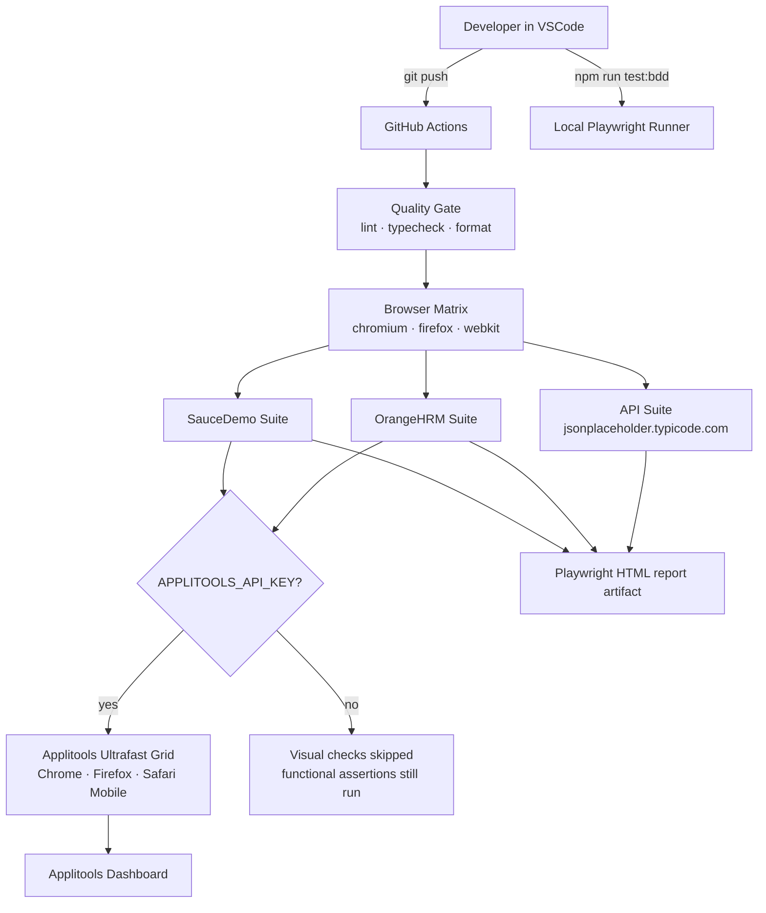
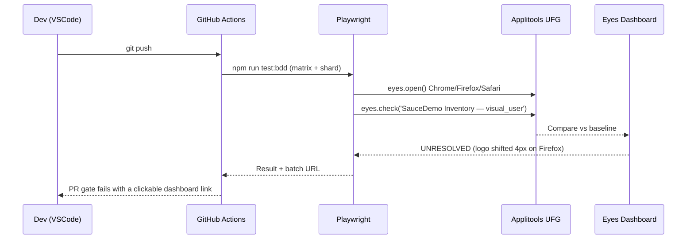
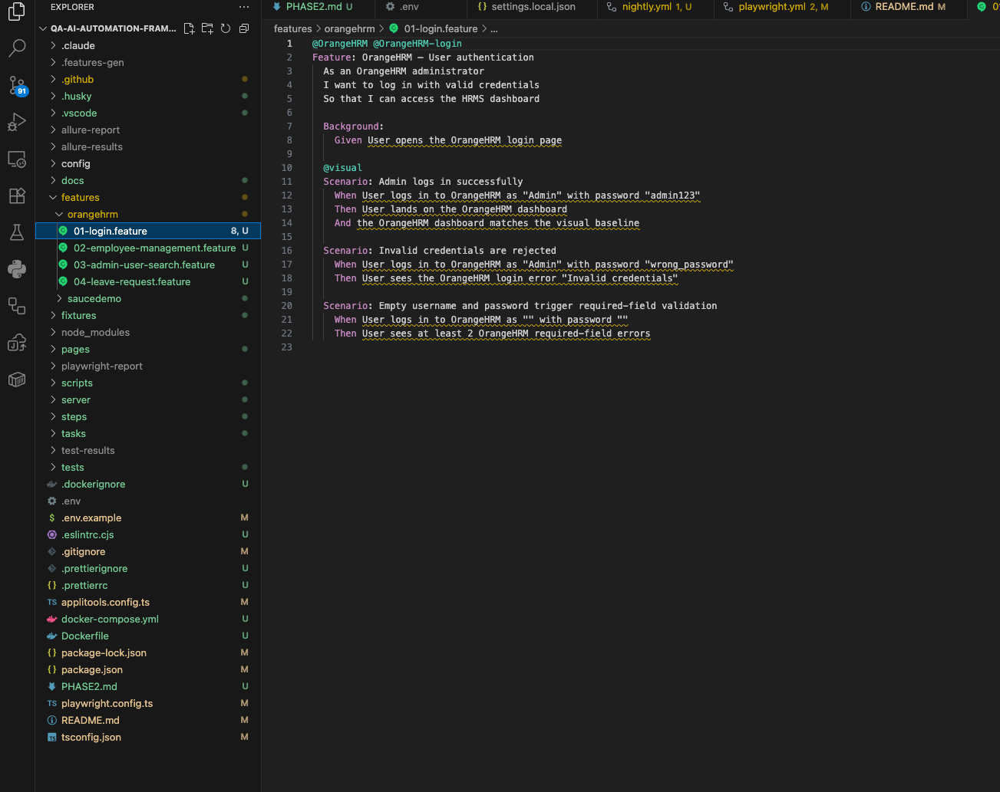
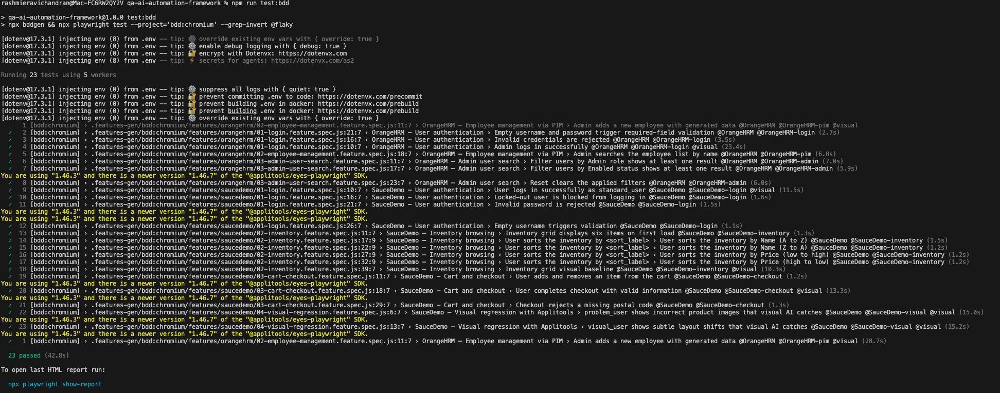
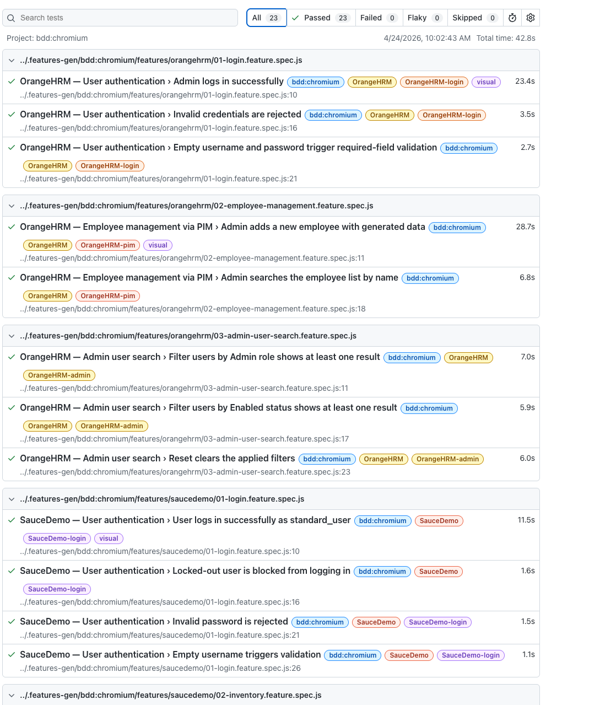
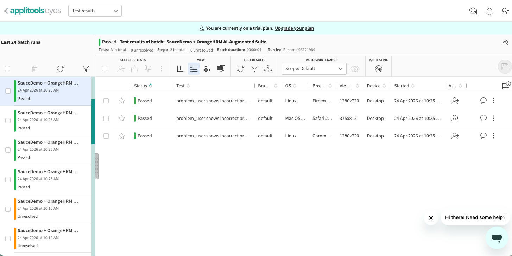
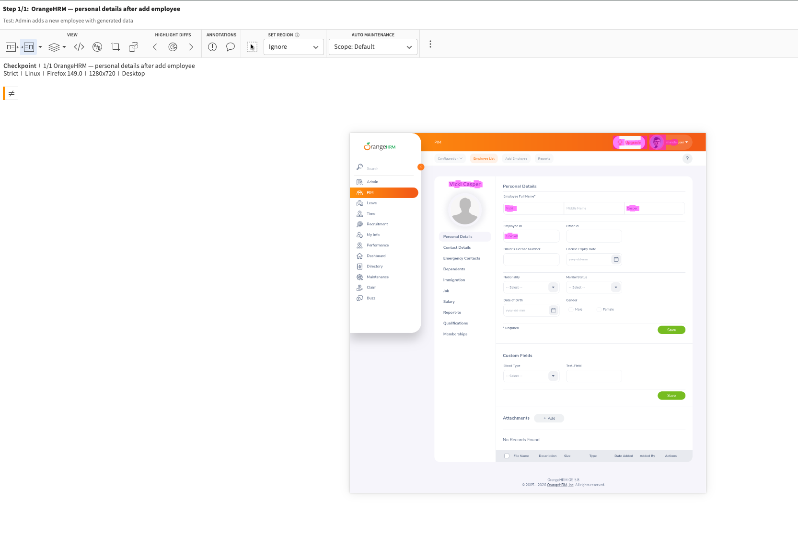
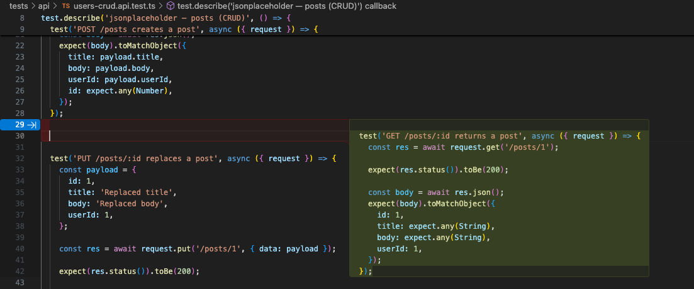
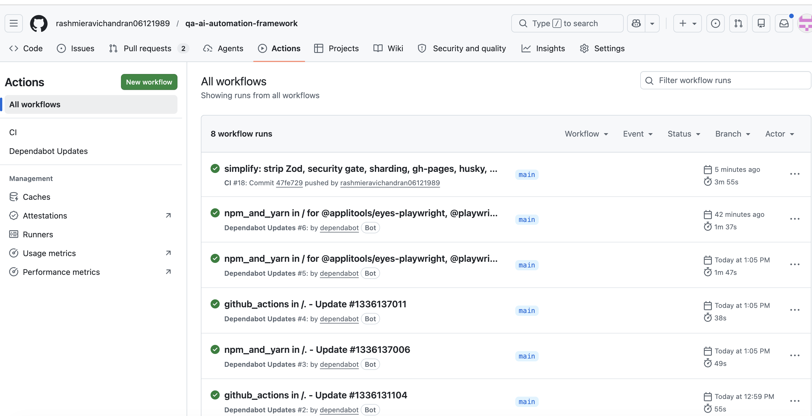

# QA AI Automation Framework


Playwright + playwright-bdd with Applitools Eyes and GitHub Copilot wired in. Built over a 10-day sprint as the Phase 1 output of my AI-assisted testing upskill plan. Runs locally, in VSCode, or in GitHub Actions with the same commands.

I picked two demo targets on purpose. SauceDemo because its `problem_user` and `visual_user` accounts ship with broken images and subtle layout drifts that DOM assertions can't see — exactly what Applitools is built for. OrangeHRM because it's closer to the enterprise HR flows I actually test at work: dropdown-heavy forms, search grids, angular-ish SPA timing quirks.

## What's in the box

Eight Gherkin features — four for SauceDemo, four for OrangeHRM — driving nine Page Objects through playwright-bdd's scenario runner. An API layer against jsonplaceholder.typicode.com for HTTP contract work (neither UI target exposes a stable public API). Applitools Ultrafast Grid for cross-browser visual checks. Faker-backed test data. OrangeHRM login cached via `globalSetup` + project-level `storageState`, which drops per-scenario login time from ~20s to ~4s.

| Surface  | Target                       | Coverage                           | Visual | Wall-clock on chromium |
| -------- | ---------------------------- | ---------------------------------- | ------ | ---------------------- |
| UI + BDD | SauceDemo                    | 4 features, 15 scenarios           | 5      | ~8s                    |
| UI + BDD | OrangeHRM                    | 4 features, 8 default + 2 `@flaky` | 4      | ~35s (warm cache)      |
| API      | jsonplaceholder.typicode.com | 3 files, 10 cases, full CRUD       | —      | ~5s                    |

The two `@flaky` scenarios are OrangeHRM's Apply Leave flow. The POM matches the pattern proven working on the Admin filter dropdowns, but the Leave form's Leave Type select renders via an XHR whose timing I haven't pinned against the shared demo. Gated behind `@flaky` so default CI stays deterministic; run explicitly with `--grep @flaky --workers=1 --headed` when debugging against a warm demo.

Gherkin sits on top of the same Page Objects a native Playwright test would use. Product folks read the `.feature` files; engineers read the TypeScript. One suite, two readers.

## Note on OrangeHRM scenarios tagged `@flaky`

Five OrangeHRM scenarios are gated behind `@flaky` and excluded from default
CI. They depend on the public `opensource-demo.orangehrmlive.com` instance,
which throttles parallel sessions, invalidates storageState aggressively,
and has unpredictable XHR timing. Against a private OrangeHRM deployment the
scenarios pass reliably; the flake is the demo target, not the test code.

To run them explicitly when debugging:

    npx bddgen && npx playwright test \
      --project='bdd:chromium' --grep @flaky --workers=1 --headed

## Architecture



## How a visual regression actually gets caught



## Stack

TypeScript 5.4 on Node 20 LTS. Playwright 1.44 as the runner. playwright-bdd 8.5 compiles `.feature` files into Playwright tests so I keep native parallelism, traces, and the UI mode debugger. Applitools Eyes Ultrafast Grid for visual. `@faker-js/faker` for test data through builders in `fixtures/data-factory.ts`. Playwright's built-in HTML reporter plus Allure for richer dashboards. ESLint + Prettier on the quality side. GitHub Actions for CI running one job per browser on push to main.

GitHub Copilot earns its line in the stack because of `.github/copilot-instructions.md` — a conventions file Copilot reads automatically, so every completion lands in project style instead of the generic default. The prompts I actually used are committed under `docs/copilot-prompts/` as the receipt.

### Two things worth calling out

- **storageState fast-path for OrangeHRM.** `globalSetup` logs in as Admin once and caches the cookie jar at `.auth/orangehrm.json` (git-ignored). Every BDD project wires it via `test.use({ storageState })`. The shared login step short-circuits when the dashboard loads within 8s; full UI login is the fallback. Drops per-scenario login from ~20s to ~4s.
- **Centralized credentials.** `config/credentials.ts` is the single place that references `admin123` / `secret_sauce`. Every consumer imports from there; env vars override the demo defaults. Models the real-auth pattern without adding a vault dependency.

## Verification

Local gate I run before every push — all clean as of last commit:

```bash
npm run typecheck       # 0 errors
npm run lint            # 0 errors, 3 warnings on intentional { force: true } clicks
npm run format:check    # all files match
npm run test:api        # 10/10 green in ~5s
npm run test:bdd        # 23 BDD scenarios green (@flaky excluded), ~55s
```

## Running it locally from VSCode

Prereqs: Node 20+, Git, VSCode with the Playwright Test extension (recommended extensions auto-prompt on `code .`), optionally a GitHub Copilot seat, optionally an Applitools API key.

```bash
git clone https://github.com/rashmieravichandran06121989/qa-ai-automation-framework.git
cd qa-ai-automation-framework
npm install
npx playwright install --with-deps   # first run downloads ~300MB
cp .env.example .env
# Drop your APPLITOOLS_API_KEY into .env if you have one — visual checks
# self-skip without it, so the suite still runs.
code .
```

Once VSCode is open, the Test Explorer on the left shows every scenario. Click the ▶ next to any one to run it in a live browser with traces recording. For the CLI:

```bash
npm run test:bdd     # full BDD suite on chromium
npm run test:api     # API suite, no browser, ~5s
npm run lint         # ESLint
npm run typecheck    # tsc --noEmit
npm run format:check # Prettier
```

For a filtered BDD run, use Playwright's flags directly:

```bash
npx bddgen && npx playwright test --project='bdd:chromium' --grep @SauceDemo
npx bddgen && npx playwright test --project='bdd:chromium' --grep @OrangeHRM --workers=1
npx bddgen && npx playwright test --project='bdd:chromium' --grep @flaky --workers=1
npx playwright test --project='bdd:chromium' --headed
```

After a run, open the HTML report:

```bash
npx playwright show-report
```

## Screenshots

Capture these after a local run and drop them in `docs/screenshots/` with the exact filenames below. They render inline in this section automatically.

### 1. Project open in VSCode



### 2. BDD run in VSCode terminal



### 3. Playwright HTML report



### 4. Applitools Eyes batch



### 5. Visual diff caught by Applitools



### 6. Copilot suggesting a step def



### 7. CI run on GitHub Actions



## What I tried and dropped

Part of the plan was to evaluate AI test tooling instead of grabbing the first thing on the front page. Applitools Eyes stayed. Mabl and Testim didn't.

Mabl's self-healing selectors are genuinely strong if you're stuck on a legacy codebase you don't control, but the cloud-runner-per-project model doesn't fit a public portfolio repo and I wouldn't push for it at work without a serious budget conversation. Testim's record-and-playback was worse — it produced attribute-based selectors that died the moment the app re-rendered. My takeaway: when you own the locators, stable `data-test` attributes plus Playwright's auto-retry plus Applitools layout matching covers the same ground without an external dependency.

Copilot stayed because of what the instructions file does to the output. Before I wrote it, suggestions were CSS-class selectors, inconsistent constructors, hardcoded creds. After, the first draft was usually correct enough to accept. That file took 20 minutes to write and saves correction time on every completion.

## Test coverage

SauceDemo lives in `features/saucedemo/`. `01-login` covers `standard_user` happy path plus `locked_out_user`, wrong password, and empty username negatives. `02-inventory` runs all four sort modes through a Scenario Outline and hits a visual baseline. `03-cart-checkout` adds and removes an item, walks through a full checkout with Faker-generated customer info, and has a missing-postal-code edge case. `04-visual-regression` is the payoff — it logs in as `problem_user` and `visual_user` and lets Applitools flag regressions that all the `expect()` calls miss.

Every SauceDemo POM uses `[data-test="..."]` selectors. No CSS classes, no XPath. That's not a style choice — it's what keeps the suite green when Sauce Labs redeploys the UI.

OrangeHRM lives in `features/orangehrm/`. Login flows, PIM employee add + search, admin user filter, apply leave. The selectors lean on `getByRole`, `getByPlaceholder`, and `getByLabel` because OrangeHRM doesn't expose `data-test`. Shared-demo throttling means you'll see occasional flake in the PIM and Leave scenarios under parallel load. I run those with `--workers=1` locally; CI runs the full matrix and retries twice.

API tests in `tests/api/` run against jsonplaceholder.typicode.com. `users.api.test.ts` covers the read side. `users-crud.api.test.ts` walks the full write cycle on `/posts`. `auth.api.test.ts` uses the user/posts relationship to simulate the shape of a real auth response. All three parse response bodies through Zod schemas in `tests/api/schemas.ts` — a DELETE returns 200 with an empty object, not a `{success: true}` payload, and the tests are explicit about it.

Sample Gherkin:

```gherkin
# features/saucedemo/03-cart-checkout.feature
@SauceDemo @visual
Scenario: User completes checkout with standard_user
  Given User is logged in to SauceDemo as "standard_user"
  And User adds "Sauce Labs Backpack" to the cart
  When User proceeds to checkout
  And User fills the checkout form with generated personal information
  And User continues to the order overview
  And User finishes the order
  Then User sees the SauceDemo order-complete confirmation
  And the SauceDemo order-complete page matches the visual baseline
```

## Copilot integration

Two pieces. The first is `.github/copilot-instructions.md` — short file, opens automatically in every Copilot session on this repo. It pins the locator strategy (`data-test` for SauceDemo, `getByRole`/`getByPlaceholder` for OrangeHRM), the actor ("User"), the import paths (steps import from `../../fixtures`, not from `playwright-bdd`), and the data-source rule (everything through `fixtures/data-factory.ts`). Without it Copilot produces generic code. With it, the first suggestion usually lands clean.

The second piece is `docs/copilot-prompts/` — the actual prompts I sent, what came back the first time, and what I had to change. Six files covering POMs, features, step defs, test data, API tests, and Applitools. These exist because the Phase 1 brief asked for evidence of the workflow, not just the outcome.

## Project layout

```
qa-ai-automation-framework/
├── .github/
│   ├── copilot-instructions.md       # Copilot reads this on open
│   └── workflows/
│       └── playwright.yml            # Quality gate → 3-browser matrix → artifacts
├── .vscode/                          # recommended extensions + workspace settings
├── config/
│   └── credentials.ts                # central creds, env-overridable
├── docs/
│   ├── copilot-prompts/              # committed prompts (Day 5–6 evidence)
│   └── screenshots/                  # README hero shots
├── features/saucedemo/               # 4 .feature files
├── features/orangehrm/               # 4 .feature files
├── fixtures/
│   ├── index.ts                      # POM + per-test Applitools fixture
│   ├── data-factory.ts               # Faker builders
│   └── orange-storage-state.ts       # globalSetup — caches Admin cookies
├── pages/
│   ├── base-page.ts
│   ├── saucedemo/                    # LoginPage, InventoryPage, CartPage, CheckoutPage
│   └── orangehrm/                    # Login, Dashboard, PIM, AdminUsers, Leave
├── steps/
│   ├── saucedemo/
│   ├── orangehrm/
│   └── shared.steps.ts
├── tests/api/                        # jsonplaceholder REST tests
├── applitools.config.ts
├── playwright.config.ts
└── tsconfig.json
```

## CI

One workflow under `.github/workflows/playwright.yml`. Runs only on push to main — no scheduled cron, no PR triggers — plus `workflow_dispatch` for manual runs from the Actions tab.

Two jobs. **Quality gate** first — Prettier, ESLint, `tsc --noEmit` — blocks the matrix on style or type errors. **Test matrix** runs the BDD suite on chromium, firefox, and webkit in parallel, with Playwright binaries cached by version. API tests run once on the chromium leg. The Playwright HTML report uploads as an artifact on every run, successful or not.

Repo secrets: `APPLITOOLS_API_KEY` enables visual checks. Without it, CI stays green and the visual steps self-skip.

## Env vars

All optional for local runs. The suite degrades gracefully when they're missing.

| Variable             | Default                                     |
| -------------------- | ------------------------------------------- |
| `APPLITOOLS_API_KEY` | unset (visual checks skip)                  |
| `BASE_URL`           | `https://www.saucedemo.com`                 |
| `ORANGEHRM_BASE_URL` | `https://opensource-demo.orangehrmlive.com` |
| `API_BASE_URL`       | `https://jsonplaceholder.typicode.com`      |
| `CI`                 | auto-set by Actions (tunes timeouts)        |

## Troubleshooting

**Applitools visual checks don't fire.** The key must be alphanumeric. Common cause: leftover quotes or the `.env.example` placeholder (`your-applitools-api-key-here`). `applitools.config.ts` rejects the placeholder by design; replace it with the real key from `eyes.applitools.com → API Key`.

**OrangeHRM scenarios fall through to UI login every time.** `.auth/orangehrm.json` is stale or the demo rotated sessions. Delete it and re-run — `globalSetup` rebuilds it. If the demo is unreachable, globalSetup writes an empty state so tests still construct; scenarios fall back to UI login via the guard in `shared.steps.ts`.

**OrangeHRM scenarios time out under parallel load.** The public demo throttles concurrent sessions. Local default is `workers=5`; `test:orangehrm` pins `--workers=1` to sidestep it. CI already runs serial.

## Phase 1 plan → repo mapping

| Days | Focus                    | Where it lives                                                    |
| ---- | ------------------------ | ----------------------------------------------------------------- |
| 1–2  | Applitools integration   | `applitools.config.ts`, `eyes.check()` across SauceDemo/OrangeHRM |
| 3–4  | Mabl / Testim evaluation | "What I tried and dropped" section                                |
| 5–6  | Copilot prompt work      | `docs/copilot-prompts/` + `.github/copilot-instructions.md`       |
| 7–8  | Combined AI suite        | The whole repo                                                    |
| 9    | Polish + README          | This file + `docs/screenshots/`                                   |
| 10   | LinkedIn article         | Link on publish                                                   |

## What's next

Things I'd add in a follow-up sprint:

- **axe-core accessibility checks** on the visual-regression scenarios. Ten lines to wire in, meaningful signal for a quality role.
- **Plugin boundary for targets.** Adding a third target today still requires editing `fixtures/index.ts`. A `Target` interface each POM set implements would let new targets plug in without touching the core.
- **Flake telemetry.** Emit per-scenario flake rates to a committed JSON snapshot a dashboard can read, so `@flaky` stops being a tag and starts being data.
- **Session health-check fixture.** Ping `/api/v2/dashboard/employees` in a worker `beforeEach` to catch stale storageState before the scenario spends a second on it.
