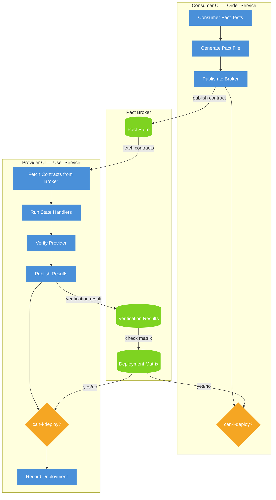
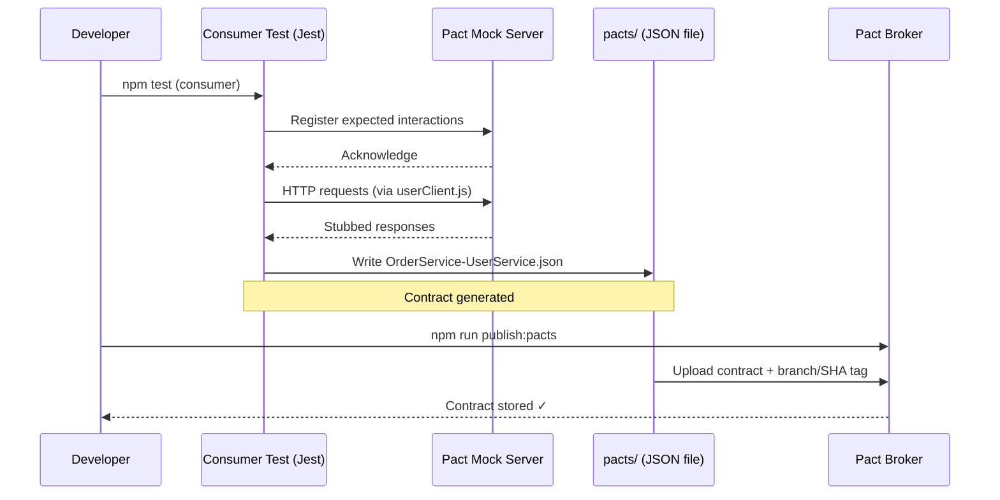
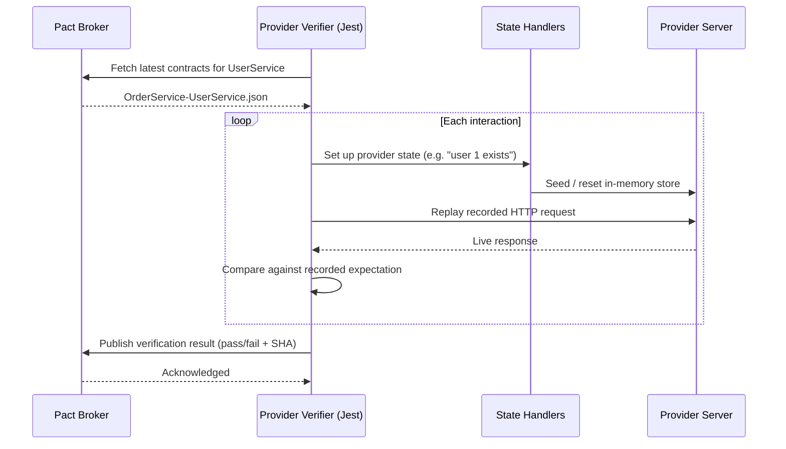
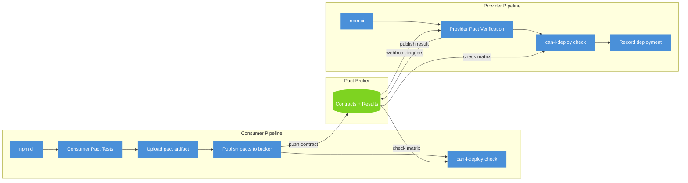
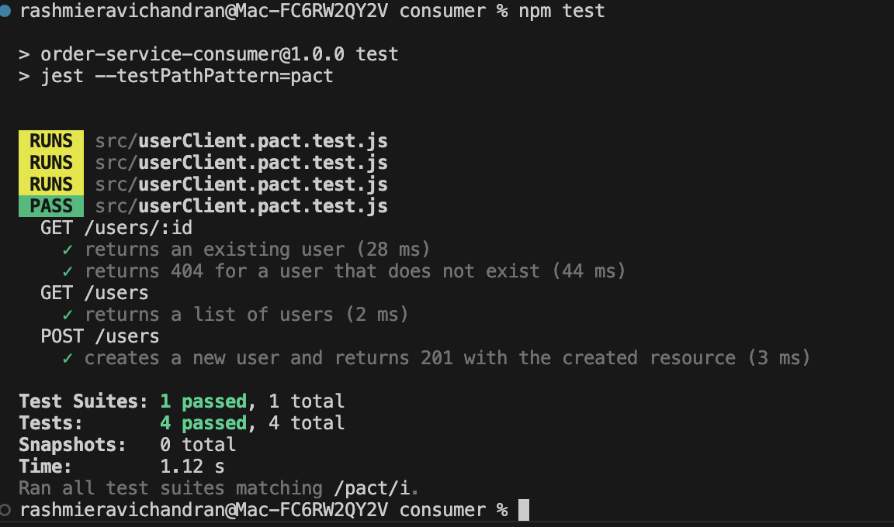
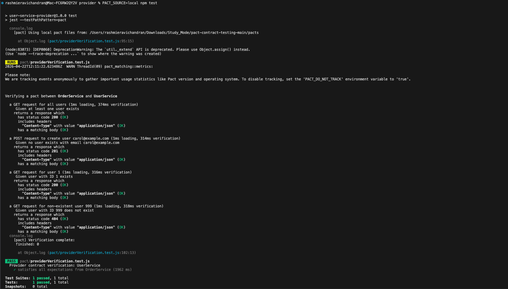

# pact-contract-testing


As a SDET — I own the full quality strategy for a 6-person development team. Integration failures between microservices were slipping through too late in our pipeline, so I introduced consumer-driven contract testing as the fix.

This repo is the production-ready reference implementation I built to prove the pattern: consumer tests, provider verification, Pact Broker, and can-i-deploy gates in CI.

---
## Scope

This repo covers consumer-driven contract testing — the Pact-specific work from my API & Contract Testing sprint. REST API negative testing and schema validation (Zod/Ajv) and GraphQL testing with Playwright were covered in that same sprint but live in separate projects.

## Broker integration (verified locally)

Full consumer-publish → provider-verify cycle running against a local Pact Broker (Postgres + Pact Broker via `docker compose up`). The broker UI shows the integration with green verification:


The verification matrix proves consumer and provider versions are compatible — this is what `can-i-deploy` checks against in CI:


## Architecture

### Overall contract flow



---

### Sequence: consumer generates a contract



---

### Sequence: provider verifies the contract



---

### CI pipeline overview



---

## Quick start

### 1. Install dependencies

```bash
cd consumer && npm install && cd ..
cd provider && npm install && cd ..
```

### 2. Run consumer tests — generates the contract

```bash
cd consumer
npm test
```

4 tests, all interactions verified against the Pact mock server. Contract written to `pacts/OrderService-UserService.json`.



### 3. Verify provider against the contract

```bash
cd provider
PACT_SOURCE=local npm test
```

Provider replays each recorded interaction against the live Express app. State handlers seed the in-memory store before each interaction runs.



### 4. Start a local Pact Broker

```bash
docker compose up -d
# Broker UI → http://localhost:9292  (admin / admin)
```

Then publish and verify via the broker:

```bash
# Publish
cd consumer
PACT_BROKER_BASE_URL=http://localhost:9292 \
PACT_BROKER_TOKEN="" \
GITHUB_SHA=$(git rev-parse HEAD) \
GITHUB_REF_NAME=main \
npm run publish:pacts

# Verify
cd ../provider
PACT_BROKER_BASE_URL=http://localhost:9292 \
PACT_BROKER_TOKEN="" \
npm test
```

---

## CI setup

Add `PACT_BROKER_BASE_URL` and `PACT_BROKER_TOKEN` as repo secrets. The consumer workflow triggers on changes to `consumer/**`, the provider on `provider/**` or a broker webhook.

The broker webhook is worth setting up — configure a "contract requiring verification published" event to trigger the provider pipeline automatically. No polling, no manual coordination between teams.

---

## Contract (sample)

`pacts/OrderService-UserService.json`:

```json
{
  "consumer": { "name": "OrderService" },
  "provider": { "name": "UserService" },
  "interactions": [
    {
      "description": "a GET request for user 1",
      "providerState": "user with ID 1 exists",
      "request": {
        "method": "GET",
        "path": "/users/1",
        "headers": { "Accept": "application/json" }
      },
      "response": {
        "status": 200,
        "body": {
          "id": 1,
          "name": "Alice",
          "email": "alice@example.com",
          "role": "admin"
        }
      }
    }
  ],
  "metadata": {
    "pactSpecification": { "version": "4.0" }
  }
}
```

---

## Repository structure

```
pact-contract-testing/
├── consumer/                         # Order Service (generates contracts)
│   ├── src/
│   │   ├── userClient.js             # HTTP client for User Service
│   │   ├── userClient.pact.test.js   # consumer pact tests → writes pacts/
│   │   └── publishPacts.js           # CLI script to push contracts to broker
│   ├── jest.config.js
│   └── package.json
│
├── provider/                         # User Service (verifies contracts)
│   ├── src/
│   │   ├── app.js                    # Express app (exported without binding)
│   │   ├── server.js                 # binds app to a port
│   │   └── routes/users.js           # user routes + in-memory store
│   ├── pact/
│   │   └── providerVerification.test.js  # verifier + state handlers
│   ├── jest.config.js
│   └── package.json
│
├── .github/
│   └── workflows/
│       └── contract-tests.yml        # consumer → publish → provider verify → can-i-deploy → record
│
├── docs/
│   ├── consumer-test-output.png
│   └── provider-test-output.png
├── docker-compose.yml                # local Pact Broker (Postgres + UI)
├── .gitignore
└── README.md
```

---

## Extending

Add a new consumer by creating a new folder, writing pact tests pointing at the same broker, and publishing with a different consumer name. The broker handles the matrix automatically — no changes needed on the provider side.

To use PactFlow, replace `PACT_BROKER_BASE_URL` with your PactFlow URL. Everything else is identical.

