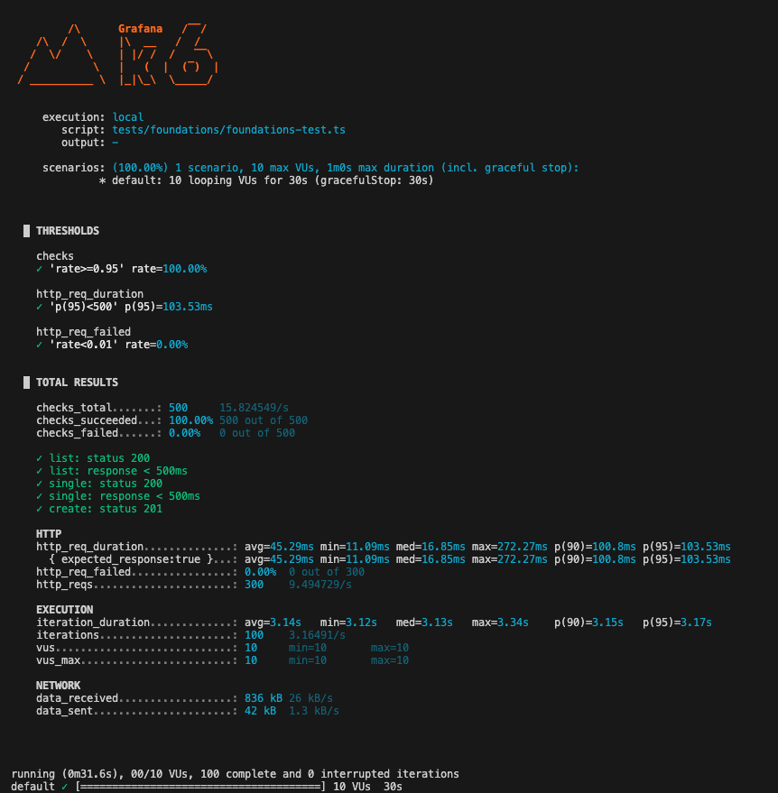
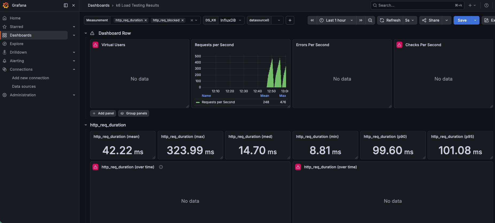

# k6-performance-suite


Performance testing suite built with k6 and TypeScript. Covers load, stress, soak, and a multi-step user journey. Thresholds fail the pipeline automatically on SLA breach; every request is tagged by endpoint so per-endpoint SLAs are enforceable in Grafana and in CI.

```bash
# one-liner smoke
K6_ENV=sandbox k6 run tests/foundations/foundations-test.ts
```

---

## Architecture

```
k6-performance-suite/
├── config/
│   ├── environments.ts     # env registry (sandbox / dev / staging / prod)
│   └── thresholds.ts       # SLA profiles (Strategy pattern)
├── utils/
│   ├── http-client.ts      # Fluent client — retry + timeout + tagging + auth
│   ├── metrics.ts          # Singleton telemetry (latency / retries / errors / success rate)
│   ├── data-factory.ts     # SharedArray-backed test data
│   ├── summary.ts          # handleSummary → stdout + JSON + JUnit
│   └── helpers.ts          # thinkTime(), assertOk()
├── tests/
│   ├── foundations/        # 10 VUs / 30s — baseline smoke
│   ├── load/               # ramp to 50 VUs — steady-hour traffic
│   ├── stress/             # ramping-arrival-rate to 200 req/s — breaking point
│   ├── soak/               # 30 VUs × 30 min — drift detection
│   └── scenarios/          # Sauce Demo shopper journey with cookie jar
├── grafana/                # InfluxDB datasource + dashboards provisioning
├── .github/workflows/      # 5-stage CI: lint → SAST → parallel perf → PR summary → soak
├── docker-compose.yml      # hardened Influx + Grafana stack
└── AUDIT-REPORT.md         # framework rationale + gap analysis
```

Design choices that matter:

- **Environment registry** — tests never hardcode a hostname. `K6_ENV=staging` switches every test to staging, including auth tokens and retry budgets.
- **Fluent HTTP client** — `http_(env).endpoint("users_list").timeout("5s").get(url)`. Forbids the common mistake of forgetting to tag metrics.
- **SLA Strategy profiles** — five named profiles (`foundation`, `steady_load`, `stress_breaking_point`, `soak_endurance`, `user_journey`). Tighten production SLAs in one place.
- **SharedArray data factory** — seeds materialised once in the main isolate; VUs read a copy-on-write view. Matters at 200+ VUs.
- **Ramping arrival rate for stress** — keeps pressure constant as the target degrades, instead of VU-count which drops rate when the target slows.

---

## Prerequisites

Tests run against [jsonplaceholder.typicode.com](https://jsonplaceholder.typicode.com) by default — no auth needed for sandbox.

```bash
# macOS
brew install k6
# Windows
choco install k6

# dev tooling (lint/typecheck/format)
npm install
```

---

## Running Tests

All tests obey the active environment profile. Default is `sandbox`.

### Foundations — smoke baseline
```bash
k6 run tests/foundations/foundations-test.ts
```
10 VUs, 30s. Run this first after cloning to verify install and baseline response times.



### Load — steady production hour
```bash
k6 run tests/load/load-test.ts
```
Ramps to 20, holds at 50 for 3m, ramps down. Named scenario `steady_hour` with `gracefulRampDown`.

### Stress — find the breaking point
```bash
k6 run tests/stress/stress-test.ts
```
`ramping-arrival-rate` from 20 → 200 req/s with `preAllocatedVUs: 50 / maxVUs: 400`. Retries are **disabled** in this test so we don't mask server-side degradation.

### Soak — 30-min endurance
```bash
k6 run tests/soak/soak-test.ts
```
30 VUs for 30 min. Each request is tagged with its elapsed-minute bucket (`elapsed=0-5m`, `5-10m`, …) so latency drift is visible per-bucket in Grafana. If `soak_response_time_ms` p(95) climbs after 15m, there's a connection or resource leak.

### Scenario — e-commerce shopper journey
```bash
k6 run tests/scenarios/ecommerce-journey.ts
```
100 concurrent shoppers walk `login → inventory → cart → checkout`, each step hitting a real jsonplaceholder endpoint (`/users/{id}`, `/users/{id}/posts`, `/users/{id}/todos`, `POST /posts`). Per-flow Trends, per-endpoint SLA, content-presence checks on every response, business-error counter on checkout failures.

> The earlier file was `sauce-demo.ts` targeting www.saucedemo.com. That site is a React SPA — `/inventory.html` and `/cart.html` are client-side routes that 404 at the origin — so the test exercised nothing real. `sauce-demo.ts` now re-exports `ecommerce-journey.ts` for backward compatibility.

---

## Running against a different environment

```bash
K6_ENV=staging STAGING_BASE_URL=https://staging.api.example.com \
  STAGING_AUTH_TOKEN=... \
  k6 run tests/load/load-test.ts
```

Profiles available: `sandbox` (default), `dev`, `staging`, `prod`. See `config/environments.ts` for the full registry. A `prod` run with no `PROD_BASE_URL` set throws at init — failing closed is by design.

See `.env.example` for every env var the suite consumes.

---

## Observability stack

```bash
# Copy the env template and set credentials (required — no anonymous admin)
cp .env.example .env
$EDITOR .env

docker compose up -d
```

Stream results into InfluxDB during a run:

```bash
k6 run --out influxdb=http://localhost:8086/k6 tests/load/load-test.ts
```

Grafana is bound to loopback (`127.0.0.1:3000`), requires credentials, anonymous access disabled. Influx auth is enforced. Containers include healthchecks, resource caps, and `unless-stopped` restart policy.



---

## Exporting results

`handleSummary` runs at the end of every test and emits three sinks automatically:

- **stdout** — textSummary for live CI console
- **reports/summary.json** — machine-readable
- **reports/junit.xml** — consumed by GitHub Actions' native test UI

```bash
mkdir -p reports
k6 run tests/load/load-test.ts
ls reports/
# junit.xml  summary.json
```

---

## Global SLAs

Defined per-profile in `config/thresholds.ts`:

| Profile | p95 | p99 | Error rate | Checks |
|---|---|---|---|---|
| `foundation` | < 500ms | — | < 1% | ≥ 95% |
| `steady_load` | < 500ms | < 800ms | < 1% (`abortOnFail` after 30s) | ≥ 95% |
| `stress_breaking_point` | < 1000ms | — | < 5% | ≥ 90% |
| `soak_endurance` | < 500ms | < 800ms | < 0.5% (`abortOnFail` after 5m) | ≥ 95% |
| `user_journey` | < 500ms | — | < 1% | ≥ 95% |

Per-endpoint SLAs layer on top (Sauce Demo journey: login < 300ms, inventory < 400ms, cart < 300ms, checkout < 300ms).

---

## CI / CD

GitHub Actions runs a 5-stage pipeline (`.github/workflows/performance.yml`):

1. **Static checks** — ESLint, Prettier, `tsc --noEmit`, Gitleaks secret scan.
2. **Security scan** — Trivy filesystem (`vuln,secret,misconfig`) → SARIF to GitHub code-scanning.
3. **Parallel perf matrix** — foundations · load · stress · scenarios in parallel. Stress is informational (no gate); the others gate.
4. **PR summary comment** — markdown table with p95 / error rate / checks per suite.
5. **Soak** — decoupled; runs only on pushes to `main` or manual dispatch (`workflow_dispatch`).

k6 version is pinned at workflow level (`K6_VERSION`). Third-party actions are pinned to commit SHAs. `concurrency: perf-${ref}` with `cancel-in-progress` stops back-to-back pushes from queueing duplicate runs. Least-privilege `permissions:` block.

> **Note:** CI screenshots in `docs/` are from the v1 pipeline and need regenerating after the first v2 run.

---

## Local dev workflow

```bash
npm run ci:verify     # lint + format:check + typecheck — same gate CI runs
npm run lint:fix      # auto-fix lint issues
npm run format        # auto-format with Prettier
npm run test:fast     # foundations + load + scenarios
npm run test:full     # everything including stress + soak (~40 min)
```

---

## Further reading

- `AUDIT-REPORT.md` — audit of the v1 codebase, rationale for every v2 pattern, and the next-day backlog (dashboards as code, baseline regression detection, chaos, IaC).
